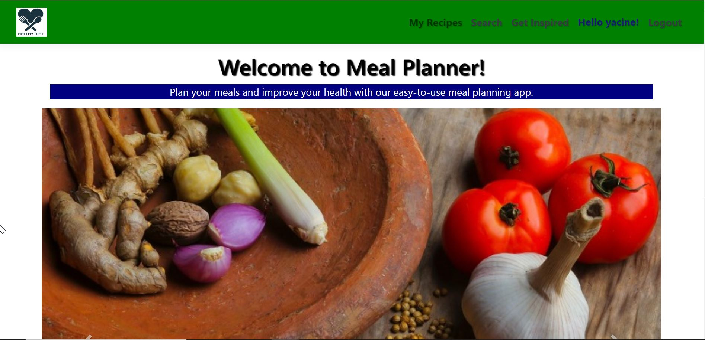
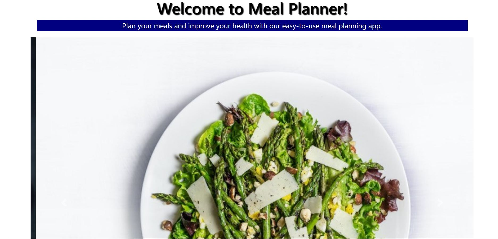
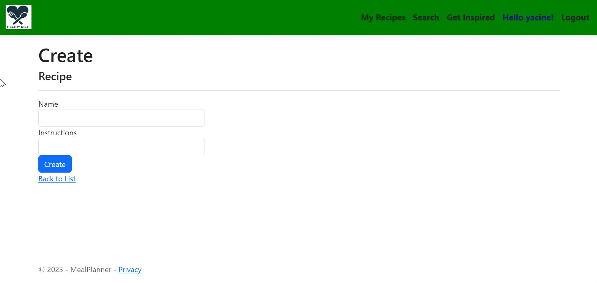
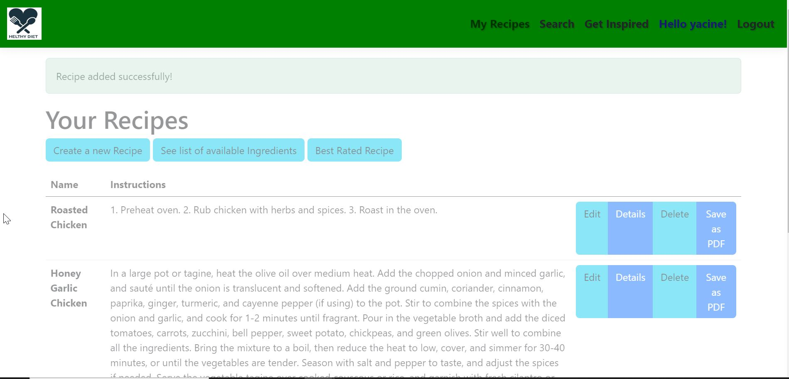
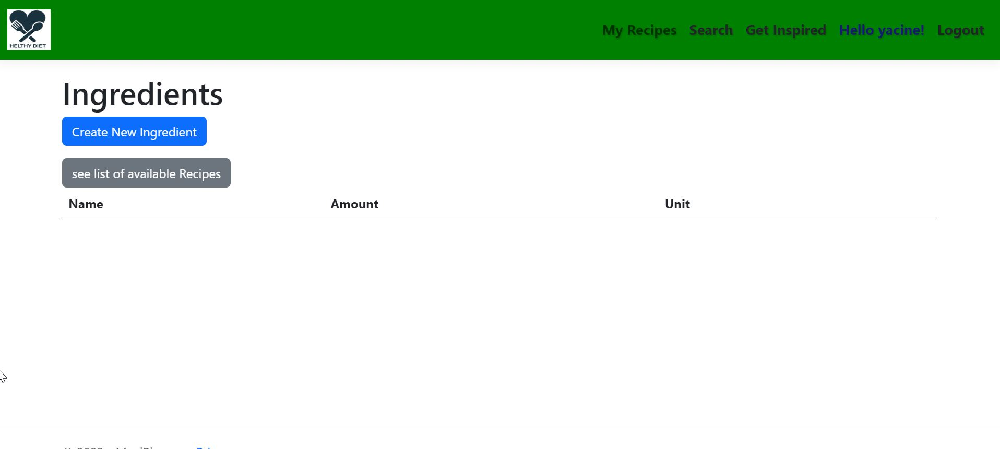
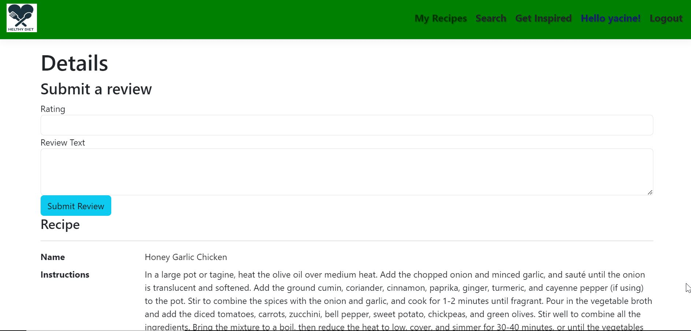
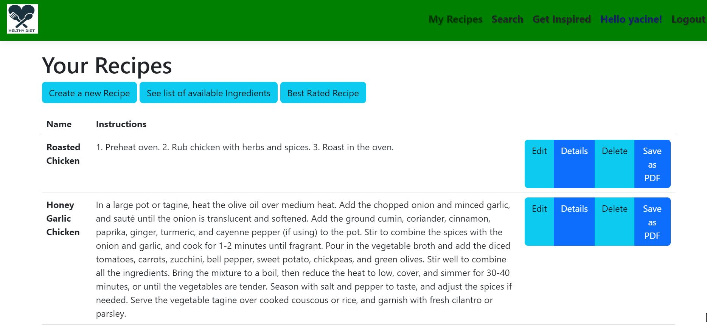
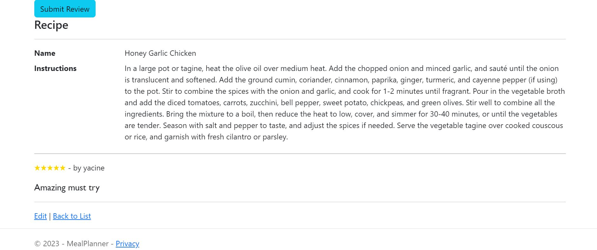
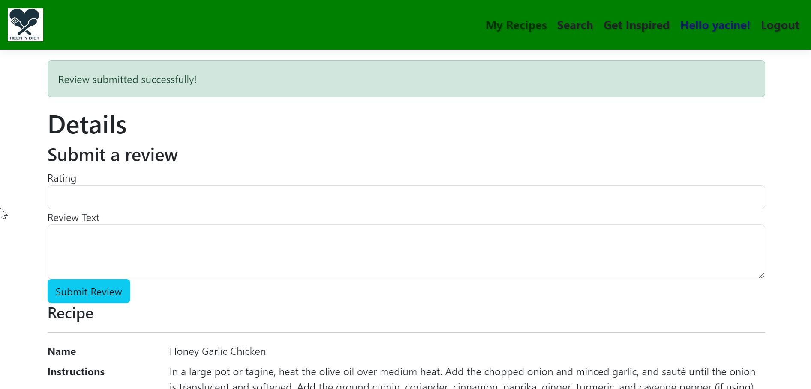
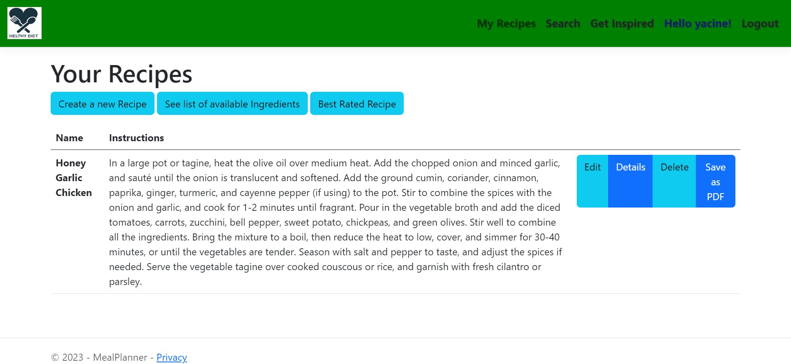

# MealPlanner
MealPlannerApp frontEnd app

The Meal Planner App is a web application that allows users to manage their meals and recipes. The app supports the following features:

Create, read, update, and delete (CRUD) operations for recipes, including ingredients and instructions
Search for recipes based on keywords or ingredients
Add, read, and delete reviews for recipes
Save recipes as PDF documents
Generate a random recipe based on selected ingredients
View and edit user profile information, including name and email address
Technologies Used
The Meal Planner App was built using the following technologies:

Front-end: HTML, CSS, JavaScript, and boostrap and tailwind
Back-end: .NET Core, C#, and Entity Framework Core
Database: Microsoft SQL Server
Authentication and authorization: JSON Web Tokens (JWT) and ASP.NET Identity

# Getting Started
To run the Meal Planner App on your local machine, you'll need to follow these steps:

Clone the repository to your local machine: git clone https://github.com/your-username/meal-planner.git
Install the latest version of .NET Core from https://dotnet.microsoft.com/download
Install the latest version of Node.js from https://nodejs.org/en/
Navigate to the MealPlannerApp directory: cd meal-planner/MealPlannerApp
Run the application: dotnet run
You should now be able to access the Meal Planner App at http://localhost:5000.

#License
The Meal Planner App is licensed under the MIT License. See the LICENSE file for more information.

Contributions
Contributions to the Meal Planner App are welcome! Please submit any bug reports, feature requests, or pull requests through the GitHub repository at https://github.com/your-username/meal-planner.
